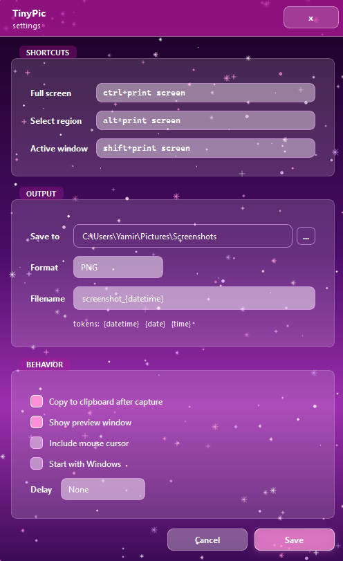

# TinyPic

Lightest portable Windows screenshot companion: fast region capture, instant clipboard, and three frameless visual themes.

 


Small Windows tool — animated themed UI, region capture with multi-monitor overlay, preview, clipboard, hotkeys, optional startup.

## About

Quick screenshots without heavy menus or installers. Starts minimized, stays portable. Grab regions, preview, copy to clipboard, and switch capture modes from the tray.

## Usage

Starts minimized. **Left-click** tray icon → region capture.

**Right-click** tray → settings and other capture modes (full screen, active window).

## Features

- Portable Windows `.exe` (see [Releases](https://github.com/sykrondev/TinyPic/releases))
- Region, full-screen, and active-window capture
- Image preview before saving or copying
- Clipboard support
- Configurable hotkeys
- Optional Windows startup
- **Three themes:** PINKCORE, ÆTHER, WEBCORE (CRT/glitch, scanlines, themed tray icons)
- **Effects presets:** `full`, `calm`, `minimal` (particles, CRT, marquee, VHS on ÆTHER preview)
- Resizable settings and preview windows (geometry saved)
- Multi-monitor region overlay with zoom lens and HUD corners
- Packaged pixel fonts (VT323, Press Start 2P, Space Mono) and theme cursors

## Themes

| Theme | Mood |
|-------|------|
| **PINKCORE** | Pink/purple frameless UI, holo border, heart cursor |
| **ÆTHER** | Monochrome minimal, cross cursor, optional VHS on preview |
| **WEBCORE** | Navy/cyan CRT, glitch titles, digital-rain particles |

Change theme and effects in **Settings → Theme / Effects → Apply**.

## Build from source

```bat
build_exe.bat
```

Output: `dist\TinyPic.exe`

Requires Python 3 and dependencies from `requirements.txt`.

## Config

User settings are stored in:

```text
%APPDATA%\TinyPic\config.json
```

Includes `theme_id`, `ui_effects`, window positions/sizes, hotkeys, and capture options.

## Inspired by

[Free Shooter](https://github.com/henrypp/freeshooter)
